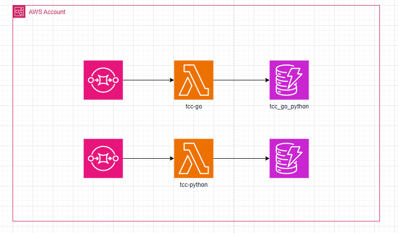

## Arquitetura infraestrutura

## Garantindo “fairness” entre Python e Go

Mesma arquitetura (ambas arm64 ou ambas x86_64).

Mesma memória e mesmo timeout.

Sem VPC (a menos que precise; VPC adiciona latência de ENI).

Provisioned Concurrency desligado (a menos que esteja comparando aquecido).

Rode primeiro 1 chamada “quente” descartável para aquecer; depois colete séries.

Execute os mesmos lotes (mesmos size_bytes, count, reps) nas duas linguagens.

Faça várias repetições (≥5) e reporte média + p95/p99.

## Checklist rápido

Tabelas: tcc_lambda_python, tcc_lambda_go (On-Demand, PK/SK).

Role IAM: tcc-lambda-dynamo-role com CloudWatch Logs + DynamoDB.

Lambda tcc-python (env TABLE_NAME), memória/timeout iguais aos do Go.

Lambda tcc-go (zip do binário), env TABLE_NAME, mesma memória/timeout.

Function URL em ambas e script driver.py para disparar lotes.

Exportar tabelas ao S3 + baixar.

CloudWatch Logs Insights: exportar CSV com Billed/Duration.

Rodar analisar.py (ou sua planilha) e montar tabelas do TCC (média, p95, custos).

0) Preparar o ambiente (2 min)

Fixar concorrência em 1 (evita spawn de instâncias novas):

Lambda → sua função (tcc-python e tcc-go) → Configuration → Concurrency → Edit → Reserved concurrency = 1.

Depois você pode voltar ao normal.

Garantir um cold start “de propósito” (opcional, mas bom):

Lambda → Configuration → Environment variables → adicione/edite uma variável besta (ex.: WARMUP_TOKEN=1, troque para 2 antes do warmup da outra linguagem).

Isso força novo deploy e garante que a próxima invocação será cold.

SQS: mantenha Batch size = 1 nos gatilhos de ambas as funções.

1) Desenho do teste (simples e academicamente justificável)

Vamos medir efeito do tamanho do payload mantendo o mesmo nº de gravações (isolando overhead por item).

Small: size_bytes = 1 KB, count = 100 → 100 writes pequenos.

Large: size_bytes = 64 KB, count = 100 → 100 writes grandes.

Por que é bom pro TCC?

Mantém constante o número de operações (PutItem) para comparar custo de serialização e I/O por item.

100 operações é um tamanho curto (não satura a partição) e já dá sinal claro de diferença de tempo/custo.

Se quiser uma variação “mesmo volume de dados”, rode depois: 1KB × 1024 vs 64KB × 16 (≈ 1 MiB) — isso mede overhead por byte (opcional).

2) Warmup (descartar) + Ensaios válidos
Se você usa duas filas (ex.: tcc-python-queue e tcc-go-queue)

SQS → fila → Send and receive messages → Send messages (um por vez mesmo).

Python

Warmup (descartar)

{ "batch_id": "py-warm-001", "size_bytes": 1024, "count": 1, "label": "WARMUP" }

Small

{ "batch_id": "py-small-1KBx100", "size_bytes": 1024, "count": 100, "label": "SMALL_1KBx100" }

Large

{ "batch_id": "py-large-64KBx100", "size_bytes": 65536, "count": 100, "label": "LARGE_64KBx100" }

Go

Warmup (descartar)

{ "batch_id": "go-warm-001", "size_bytes": 1024, "count": 1, "label": "WARMUP" }

Small

{ "batch_id": "go-small-1KBx100", "size_bytes": 1024, "count": 100, "label": "SMALL_1KBx100" }

Large

{ "batch_id": "go-large-64KBx100", "size_bytes": 65536, "count": 100, "label": "LARGE_64KBx100" }

Envie nesta ordem por linguagem: Warmup → Small → Large (um de cada, esperando a fila esvaziar).
Isso garante que Small/Large rodem quentes.

Se você usa uma fila compartilhada

Envie os mesmos bodies, mas adicione Message Attribute lang (String) = "python" ou "go" conforme a função que o filtro do trigger espera.

3) Coleta dos resultados
A) Latência/tempo (CloudWatch Logs Insights)

Para cada função:

CloudWatch → Logs Insights → selecione o log group /aws/lambda/tcc-python (depois o do Go).

Janela de tempo: pegue os últimos 30–60 min (ou o intervalo exato do teste).

Query:

fields @timestamp, @message
| filter @message like /REPORT/
| parse @message /Duration: * ms/ as dur_ms
| parse @message /Billed Duration: * ms/ as billed_ms
| parse @message /Init Duration: * ms/ as init_ms
| sort @timestamp asc

Você verá 3 linhas por linguagem na ordem que executou:

1ª (Warmup): terá Init Duration (cold) → descarte.

2ª (Small) e 3ª (Large): anote Duration e Billed Duration.

Dica: se você imprimiu label no código, dá pra parsear também. Sem isso, a ordem temporal já identifica quem é Small/Large.

B) Confirmação de inserts (DynamoDB)

DynamoDB → tabela → Explore table items → Query:

Partition key (pk) = batch_id#py-small-1KBx100 (troque pelo seu batch_id)

Deve retornar 100 itens. Repita para os outros batch_id.

(Se quiser, faça Export to S3 mais tarde para análises detalhadas; mas pra este ensaio simples, a consulta já basta.)

Como compilar GO e exportar lambda no powershell:
go mod tidy
$env:GOOS="linux"; $env:GOARCH="arm64"    # ou amd64
$env:CGO_ENABLED="0"
go build -trimpath -ldflags="-s -w" -o bootstrap
Compress-Archive -Path .\bootstrap -DestinationPath function.zip -Force